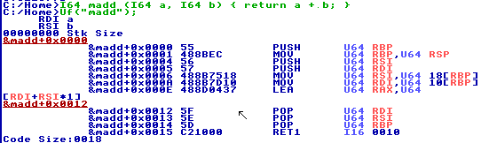
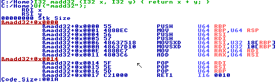

Note that this page is unfinished and may be completely wrong, should get you with the very very basic right now.  
Disassembling can be done with the function `U0 Uf(U8 *st);`  
This function takes a string of the functions name (so you can't pass a function pointer into it.) and prints out a disassembly of it.  
Example:  
`> I64 madd (I64 a, I64 b) { return a + b; }`  
`> Uf("madd");`  
  
(I honestly don't feel like typing this out)  
It finds the parameters you're using and tells you what registers the values are stored in. Argument `a` is stored in register RDI, and Argument `b` is stored in register RSI.  
The number before "Stk Size" is, well, the Stack Size. This is expanded the more internal variables you have.  
There are many registers, usually three letters but there are two letter ones as well. If it starts with an R (like RDI, RSI) then it's 64bits. It can store a 64bit integer, and is what I64/U64 uses.  
If it starts with an E (like EAX, EDI) then it's 32bits. It can store a 32bit integer, and is logically what I32/U32 uses.  
Then there's the two letter registers, AX, and such, which are 16bits.  
At the end of the HolyC.DD document (Can be found in the Help Menu, which is accessed via F1), it says "All values are extended to 64-bit when accessed. Intermediate calculations are done with 64-bit values.", as well in the Strategy.DD document (See Help Menu) it says "Compiler extends all values to 64-bit when fetched and does only 64-bit computations intermediately."  
In Tips.DD (See Help Menu) it says "64-bit values are most efficient for the compiler" (I imagine due to it not having to extend them to 64-bit.)  
In GuideLines.DD (See Help Menu), it says "Use I64 instead of smaller int sizes because the compiler converts everything to 64-bit."  
So, the compiler has to do extra work to convert your code to 64-bit, and so you should use I64/U64 instead. Personally, I've used smaller sizes without issue, and feel it's more clearer, but you should not use smaller sizes because of performance reasons.. because they aren't gonna help.  

If we were to modify the function to use 32bit integers:  
`> U32 madd32 (I32 x, I32 y) { return x + y; }`  
`> Uf("madd32");`  
  
It changes a portion of the code:
```asm
MOV U64 RSI,U64 18[RBP]
MOV U64 RDI,U64 10[RBP]
LEA U64 RAX,U64 [RDI+RSI*1]
```
to:
```asm
MOVSXD U64 RSI,U32 18[RBP]
MOVSXD U64 RDI,U32 10[RBP]
MOV U64 RAX,U64 RDI
ADD U64 RAX,U64 RSI
```
The first version uses the `MOV` instruction to mov a value from the stack (offset from RBP) to store parameter `b` *into* RSI. We know this is where the parameter `b` is stored since the `Uf` function told us so in the first few lines. RBP[18] simply means add 18 to RBP, and treats it as a 
TODO: continue this