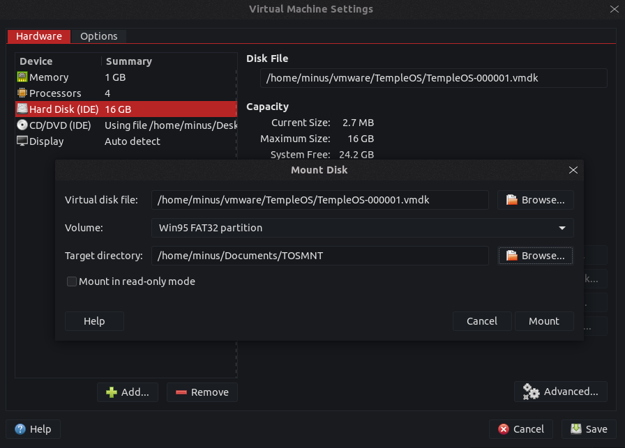
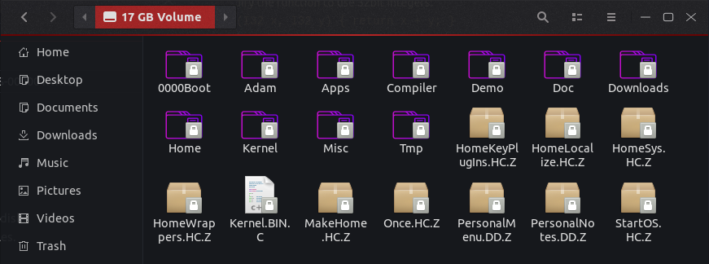

Various methods for transferring files between TempleOS and your other OS.  
.. obviously you could manually type them out, but that would be unpleasant.

# VMWare Workstation Mounting
Only tested on: Linux (Ubuntu)  
Should work on other Linux distros, but no clue if it operates the same on Windows/Mac.  
Open your Virtual Machine Settings for TempleOS. Then in the 'Hardware' tab, click the Hard Disk device. Hopefully the first button on the right should be to mount the disk. Click it. It will ask for sudo (might ask for admin on windows?) permission, give it.  
You'll see this menu:  
  
The `Virtual Disk File`'s default file should be correct, and the volume should be 'Win95 FAT32 partition'. I changed the target directory from the default on my system (`/mnt/`) to a folder I created in my documents folder, easier to access.  
Click 'Mount'. Now, find where you told it to put it and open the folder. If it's empty, then perhaps you should retry. I only ran into it being empty when it wasn't mounted.  
So, now we have access to the data, 

The files ending with `.Z` are TempleOS's compressed files, which I doubt you'll be able to edit without decompressing them. There is a program located in the Downloads folder for decompressing them, but you may have to compile it. (It's in CPP). It's usually easier to me just to make them uncompressed in TempleOS.  
You can now add files and edit files that are uncompressed to the system. Don't use anything other than ascii, as I doubt TempleOS will like anything beyond that.  
You might be unable to save files, if so then start your text editor with with admin rights (`sudo`), and edit the file then.  
Before rebooting TempleOS, I'd press where the "Mount" button was (should now read "Unmount"), to make so there will likely not be any theoretical problems.

# ISO
I've had issues creating my own iso, and using any others than the TempleOS.iso and the supplemental ISOs. Anything I tried creating on my own, or one I tried (GKey iso), resulted in filesystem errors for it.  
So you can mount these in VMWare as disks and they work, but I haven't managed to get anything else working.  